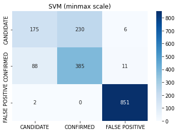

# Exoplanet Exploration - Machine Learning

## Aim

To develop machine learning models capable of classifying candidate exoplanets from the raw dataset.

## Data source

https://www.kaggle.com/datasets/nasa/kepler-exoplanet-search-results

## Method

- Remove unnecessary columns and null rows.
- Preprocess data using standardscaling / minmaxscaling / PCA.
- Tune model parameters with gridsearch.
- Experiment with various algorithms to develop a model with high accuracy score. 

## Model Performance Reports

### SVM (use minmax scaler)

 

### SVM (use standard scaler)

 

### Random forest

 

## Findings
- Random forest model has the highest accuracy score (accuracy of 90%). 
- With SVM model, scaling data using standard scaler produces more accurate model compared to minmax scaler (accuracy of 81% vs 88%).
- All models predict "false positive" category most accurately.
- All models predict "candidate" category with the least accuracy. 